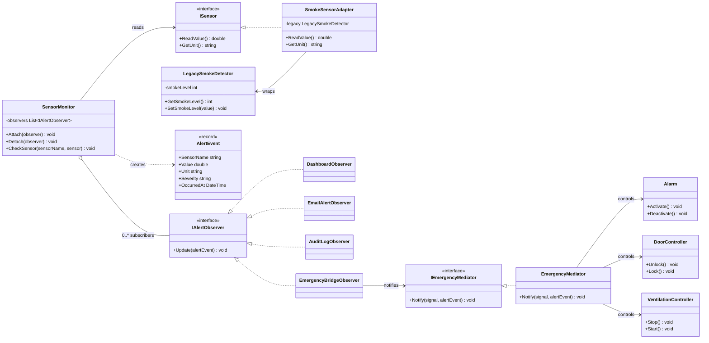
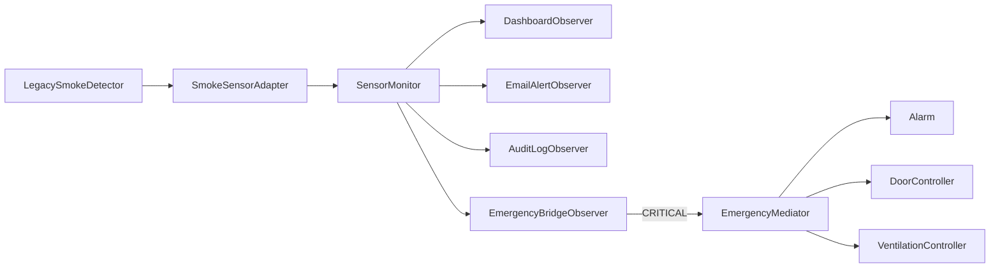

# Sơ đồ lớp UML – Campus Safety Hub

Sơ đồ sử dụng Mermaid `classDiagram`, có thể xem trực tiếp trên GitHub.

```mermaid
classDiagram
    direction LR

    class ISensor {
        <<interface>>
        +ReadValue() double
        +GetUnit() string
    }
    class LegacySmokeDetector {
        -smokeLevel int
        +GetSmokeLevel() int
        +SetSmokeLevel(value) void
    }
    class SmokeSensorAdapter {
        -legacy LegacySmokeDetector
        +ReadValue() double
        +GetUnit() string
    }
    class AlertEvent {
        <<record>>
        +SensorName string
        +Value double
        +Unit string
        +Severity string
        +OccurredAt DateTime
    }
    class IAlertObserver {
        <<interface>>
        +Update(alertEvent) void
    }
    class SensorMonitor {
        -observers List~IAlertObserver~
        +Attach(observer) void
        +Detach(observer) void
        +CheckSensor(sensorName, sensor) void
    }
    class DashboardObserver
    class EmailAlertObserver
    class AuditLogObserver
    class EmergencyBridgeObserver
    class IEmergencyMediator {
        <<interface>>
        +Notify(signal, alertEvent) void
    }
    class EmergencyMediator {
        +Notify(signal, alertEvent) void
    }
    class Alarm {
        +Activate() void
        +Deactivate() void
    }
    class DoorController {
        +Unlock() void
        +Lock() void
    }
    class VentilationController {
        +Stop() void
        +Start() void
    }

    ISensor <|.. SmokeSensorAdapter
    LegacySmokeDetector <-- SmokeSensorAdapter : wraps
    SensorMonitor --> ISensor : reads
    SensorMonitor o-- IAlertObserver : 0..* subscribers
    SensorMonitor ..> AlertEvent : creates
    IAlertObserver <|.. DashboardObserver
    IAlertObserver <|.. EmailAlertObserver
    IAlertObserver <|.. AuditLogObserver
    IAlertObserver <|.. EmergencyBridgeObserver
    EmergencyBridgeObserver --> IEmergencyMediator : notifies
    IEmergencyMediator <|.. EmergencyMediator
    EmergencyMediator --> Alarm : controls
    EmergencyMediator --> DoorController : controls
    EmergencyMediator --> VentilationController : controls
```

## Luồng hoạt động

```mermaid
flowchart LR
    A[LegacySmokeDetector] --> B[SmokeSensorAdapter]
    B --> C[SensorMonitor]
    C --> D[DashboardObserver]
    C --> E[EmailAlertObserver]
    C --> F[AuditLogObserver]
    C --> G[EmergencyBridgeObserver]
    G -->|CRITICAL| H[EmergencyMediator]
    H --> I[Alarm]
    H --> J[DoorController]
    H --> K[VentilationController]
```
